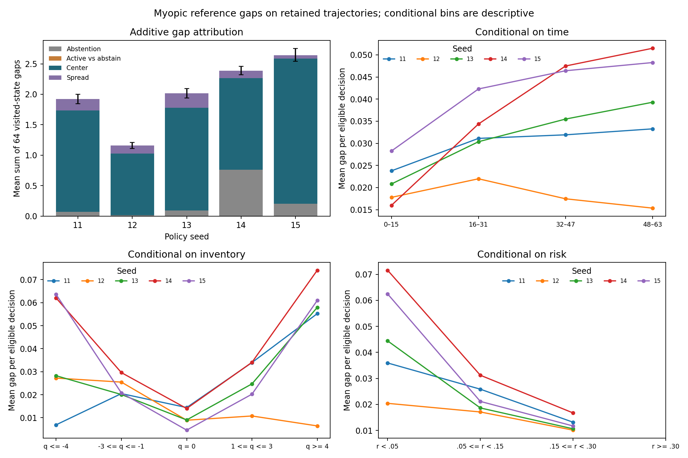
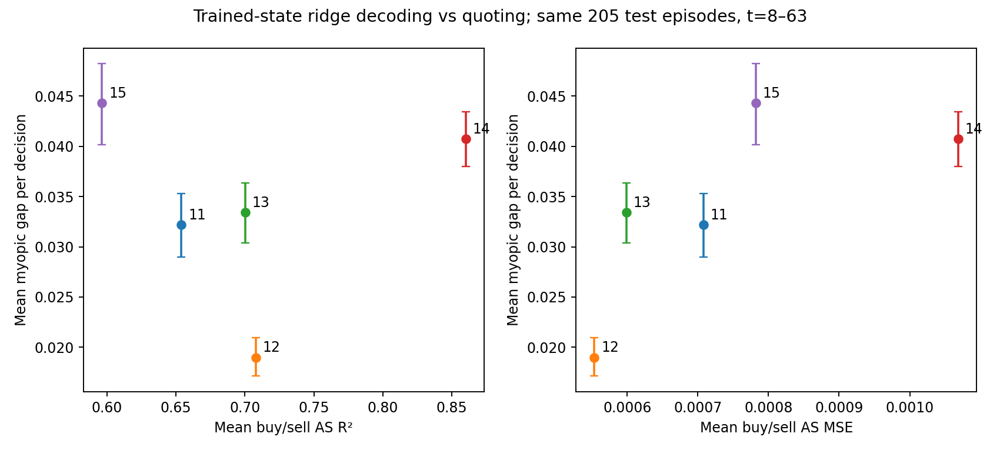

# Myopic decision gaps on retained policy trajectories

**Quote-center choice accounts for 81.5% of the mean one-step score gap.** Abstention accounts for 11.2% and spread choice for 7.3%. Center choice is the largest component in every policy seed. High adverse-selection decoding R² does not consistently imply good quoting: seed 14 has the highest R² and the lowest realized objective on this cohort.

## Data and estimand

This exploratory audit uses all five original entropy-.01 policies, seeds 11–15, on their retained 1,024-episode cohort beginning at 14,000,000: 327,680 decisions in total. These trajectories were previously inspected for the [nonlinear control](nonlinear_memo.md). No model was trained, decoder fitted, or episode collected for this analysis. Results do not describe the separate replication seeds 21–25.

At each predecision posterior `w` and inventory `q`, define the myopic action score

`S(a) = E[execution profit | w,a] − (.001/64) E[(q + Δq)² − q² | w,a]`.

Abstention has score zero because the common current-inventory charge cancels. For saved action probabilities `π`, the gap is `max_a S(a) − Σ_a π(a) S(a)`. Float32 probabilities are converted to float64 and renormalized; the largest original row-sum error is 3.44e−7. The statistic averages over the policy distribution rather than its sampled action.

The four nonnegative components sum exactly to the gap. Abstention contributes `π(abstain) max_a S(a)`. Active participation contributes the active probability times `max_a S(a) − max_active S(a)`. The remaining active-action gap is split between center and spread by averaging both coordinate-correction orders: optimize center then spread, and spread then center. This splits interactions symmetrically; it is an attribution of reference scores, not a causal intervention.

## Outcomes

The mean sum of gaps over 64 visited decisions is **2.026**, with separate approximate training-seed interval **[1.326, 2.726]** and conditional episode-bootstrap interval **[1.972, 2.079]**. These are not joint intervals. The episode bootstrap resamples complete episodes after averaging the five policies; conditional-bin intervals resample each policy's complete episodes and recompute the ratio of gap totals to eligible decision counts.

| Seed | Realized objective | Sum of myopic gaps | Center component | Abstention component | Spread component |
|---|---:|---:|---:|---:|---:|
| 11 | 1.649 | 1.922 | 1.664 | .071 | .186 |
| 12 | 2.364 | 1.161 | 1.015 | .014 | .133 |
| 13 | 1.424 | 2.015 | 1.685 | .091 | .239 |
| 14 | .361 | 2.389 | 1.506 | .760 | .124 |
| 15 | .741 | 2.644 | 2.383 | .200 | .060 |

The active-versus-abstention component is zero on every saved decision: at least one active quote always scores as well as abstention. Seed 14's abstention term is substantial, but center choice remains its largest component. Component percentages above are ratios of across-seed mean components to the mean total gap.



Error bars on total gaps are whole-episode 95% bootstrap intervals for each fixed policy. Conditional profiles show point estimates; their intervals and sample counts are in the [summary](../published-results/decision-quality-v1/summary.json). Four seeds have larger gaps in the last 16 arrivals than the first 16; seed 12 improves after its second quarter. Inventory asymmetry differs by seed: seed 11's gap is .0069 at `q ≤ −4` and .0553 at `q ≥ 4`, whereas seed 12's corresponding values are .0272 and .0064.

Every policy has larger gaps in the low reference-risk bin `r < .05` than in `.15 ≤ r < .30`, where `r` is the mean buy/sell adverse value revision at quote `(.2,.8)`. The fixed `r ≥ .30` bin contains no decisions and is left empty. These are conditional descriptions of endogenous visited states; time, inventory and risk are not independently varied.

## Decoding and decision quality

The comparison below uses trained hidden/cell-state ridge predictions and gaps on the **same 205 test episodes, arrivals 8–63**. Each decoder and its preprocessing remain fixed. Scores average the buy- and sell-side adverse-selection targets.

| Seed | AS R² | AS MSE × 1,000 | Mean decision gap |
|---|---:|---:|---:|
| 11 | .654 | .708 | .0322 |
| 12 | .708 | .553 | .0190 |
| 13 | .700 | .599 | .0334 |
| 14 | .860 | 1.069 | .0407 |
| 15 | .596 | .782 | .0443 |



Across five policies, Spearman correlation with the gap is **−.30 for R²** and **+.80 for MSE**. These are descriptive coefficients, without significance claims. Each policy visits a different history distribution; R² also uses a different target variance. Seed 14's mean buy/sell target variance is about .00765 versus .00189 for seed 12, explaining how seed 14 can have both higher R² and worse absolute error. Its high R² does not establish superior inference accuracy or effective policy use. Vertical intervals condition on fixed policies and do not cover decoder-fitting uncertainty.

## Interpretation and reproducibility

The consistent failure is quote-center alignment under the one-step reference. Center scores depend on expected value, inventory and the joint posterior; this is not an isolated adverse-selection mechanism. Summed gaps are evaluated on the original policy's states. They are **not recoverable returns**: changing actions changes future observations, inventory and information. The myopic reference also ignores information acquisition and future carrying costs. No older-history matching or causal state intervention was performed.

A targeted next experiment would test whether a small action-score readout fitted to frozen recurrent states can improve center selection on a separately specified evaluation design, with matched history-only inputs as a control. That would test accessibility of decision-relevant information rather than add another latent-variable decoder. It has not run; the current result does not yet identify whether the recurrent representation, actor readout or PPO optimization causes the gap.

```powershell
python -m scripts.analyze_decisions
python -m pytest tests/test_decision_quality.py -q
python -m scripts.verify_publication
```

Collection artifacts must exist under `results/nonlinear_v1`; see the [nonlinear-control reproduction instructions](nonlinear_memo.md). The audit verifies their original published identities, replays posterior updates from public actions/outcomes, reconstructs inventory and terminal accounting, validates decoder splits and metrics, and checks the additive decomposition. Scalar-reference and outcome-enumeration tests validate vectorized scores. The full suite passes **168 tests**. [Episode aggregates](../published-results/decision-quality-v1/episodes.csv) and the [publication manifest](../published-results/decision-quality-v1/publication_manifest.json) preserve the evidence separately from earlier snapshots.
