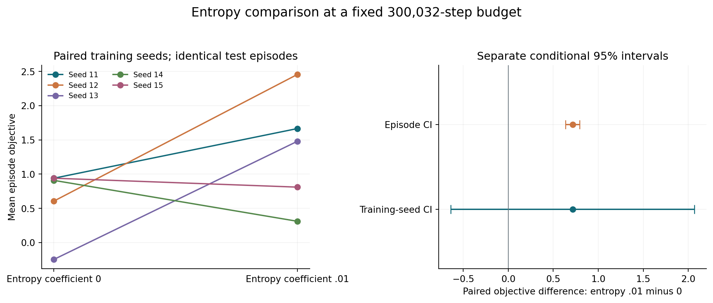
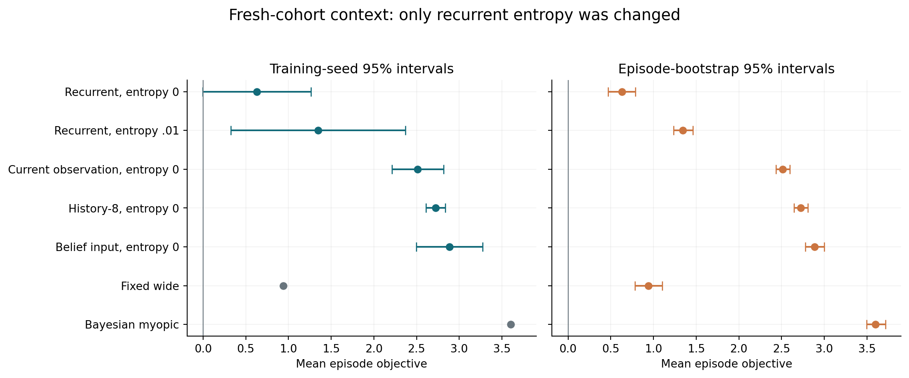
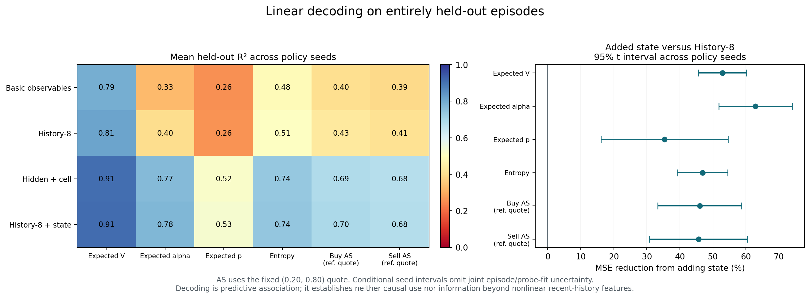

# Does the Agent Know When It's Being Picked Off?
## Single-factor entropy experiment — 27 September 2026

**Entropy regularization produced useful adaptive behavior in three of five recurrent runs, but did not establish reliable learning across initializations or a recurrence advantage.** Mean objective increased from **0.630 to 1.345**. The paired effect was **+0.715**, with training-seed 95% interval **[−0.638, 2.069]**. Two seeds worsened. Keep every seed in the analysis and distinguish this promising development result from confirmation.

### Controlled experiment

The [protocol](entropy_protocol.md) fixed five recurrent treatment runs, seeds 11–15, at **300,032 transitions** each. Only entropy coefficient changed from zero to **.01**. GAE remained .95, gamma one, learning rate .0003, eight environments, 128-step rollouts, batch64 and ten PPO epochs. Architecture, simulator, public observation features and economic objective were unchanged. Entropy contributes to the optimization loss, not to reported economic profit.

The zero-entropy controls are the existing budget-follow-up checkpoints. Initial weights and simulator streams matched within each seed, as did the first pre-update rollout's economic logs. These are five paired comparisons, not ten independent replicates. No checkpoint selection, seed replacement or outcome-dependent budget extension occurred. New training totaled **1,500,160 transitions** in **861.4 seconds (14.4 minutes)** with three CPU workers; summed process training time was **2,133.5 seconds**. Evaluation and audits shared CPU resources and are additional stages.

Both arms and all contextual baselines used the same **2,048 fresh episodes**, beginning at 11,000,000. Customer tapes and separate action-sampling uniforms were paired; policies' quotes still generated their own executions. Reusing the same checkpoints on this fresh cohort explains differences from previous reports. The reserved development cohort at 10,000,000 remains unused.

### Economic result

| Seed | Entropy 0 | Entropy .01 | Paired difference |
|---|---:|---:|---:|
| 11 | 0.940 | 1.666 | +0.726 |
| 12 | 0.606 | 2.457 | +1.851 |
| 13 | −0.246 | 1.481 | +1.727 |
| 14 | 0.909 | 0.311 | −0.598 |
| 15 | 0.940 | 0.810 | −0.130 |
| Mean | **0.630** | **1.345** | **+0.715** |

The approximate Student t4 interval across the five paired seed differences is **[−0.638, 2.069]**. The separate whole-episode bootstrap interval is **[0.638, 0.794]**, conditional on these fitted models. For the episode interval, differences are averaged across seeds within an episode before resampling whole episodes. The narrow episode interval does not resolve training variability. Neither interval combines both uncertainty sources; five-seed intervals are approximate.

| Policy | Mean objective | Training-seed SD | Episode SE |
|---|---:|---:|---:|
| Recurrent, entropy 0 | 0.630 | 0.510 | 0.081 |
| Recurrent, entropy .01 | 1.345 | 0.824 | 0.057 |
| Current observation, entropy 0 | 2.512 | 0.244 | 0.043 |
| History-8, entropy 0 | 2.723 | 0.092 | 0.041 |
| Belief input, entropy 0 | 2.886 | 0.313 | 0.056 |
| Fixed wide `(0.20,0.80)` | 0.940 | — | 0.081 |
| Bayesian myopic | 3.602 | — | 0.055 |
| Abstention | 0.000 | — | 0.000 |

Other predeclared fixed actions 2, 4 and 8 earned −0.304, −0.195 and −0.315. The myopic reference is not a proven finite-horizon optimum. All five recurrent treatments remain below their paired current-observation and history-8 comparators. The recurrent-minus-history mean is **−1.378**, seed interval **[−2.411, −0.345]**. These are contextual comparisons with different architectures and capacities; only recurrent entropy was changed.

### Behavior gate

Seeds 11–13 beat fixed wide quoting by **0.726, 1.517 and 0.540**, with conditional episode intervals **[0.619, 0.835]**, **[1.412, 1.623]** and **[0.464, 0.616]**. Their action-probability variation across episodes at fixed time was **0.192, 0.301 and 0.113**. They use multiple quote centers and spreads; the variation is not just categorical action-sampling noise. It can still reflect current observations or inventory rather than older memory or adverse-selection inference.

Seeds 14 and 15 fail the behavior criterion. Seed 14 abstains on **39.16%** of decisions and earns 0.311; seed 15 uses fixed wide quotes **89.58%** of the time and has negligible input-dependent variation. The aggregate gain over fixed wide is **+0.405**, but its seed interval **[−0.618, 1.427]** includes zero. The three useful seeds meet the protocol's qualitative “several seeds” gate for **exploratory decoding**, not for a claim of reliable family-wide success. Both failed seeds remain in that analysis.

Mean pre-penalty profit increased from **0.707 to 1.399**, while the inventory penalty declined from **0.0774 to 0.0540**. Mean squared inventory fell from **77.41 to 54.03**, and abstention increased from **2.61% to 9.87%**. The pooled descriptive 5th-percentile objective improved from **−6.035 to −3.502**; mean profit per informed execution changed from **−0.2030 to −0.1691**. These describe the changed policies and their selected executions, not an isolated causal mechanism or direct evidence that informed customer type was inferred.

### Exploratory representation analysis

All five frozen treatment models collected **1,024 separate episodes** beginning at 12,000,000. Each archive has 65,536 decisions; probes use arrivals 8–63, or **57,344 rows**. Whole episodes split into **614 training, 205 validation and 205 test episodes**. Scaling and fits use training episodes only; the ridge coefficient is chosen on validation episodes, with no refitting on test data. Targets are posterior expected value, informed fraction, directional demand, entropy and buy/sell adverse information at the fixed `(0.20,0.80)` quote. They are observation-supported posterior quantities, not the hidden regime labels.

The untrained network has the same architecture and initialization seed and replays each trained policy's exact public observations without choosing actions. This controls for the predictive features of a random recurrent transformation on the same histories. Every target has positive held-out variance in every seed; no constant target was silently assigned a favorable R². The probe audit verifies full trajectories, split IDs, saved prediction losses and unchanged checkpoint hashes.

Mean held-out R² across all five seeds:

| Features | Value | Alpha | p | Entropy | Buy AS | Sell AS |
|---|---:|---:|---:|---:|---:|---:|
| Basic observables | .793 | .328 | .256 | .485 | .401 | .389 |
| History-8 | .813 | .395 | .261 | .507 | .432 | .408 |
| Trained hidden + cell | .909 | .766 | .517 | .735 | .691 | .676 |
| Basic + trained state | .910 | .769 | .522 | .737 | .693 | .677 |
| History-8 + trained state | .911 | .776 | .530 | .741 | .696 | .681 |
| Untrained hidden + cell | .891 | .695 | .456 | .690 | .609 | .591 |
| History-8 + untrained state | .894 | .707 | .469 | .696 | .620 | .597 |

Adding trained state to linear history features reduces held-out MSE for all six targets, by mean relative amounts **52.9%, 62.9%, 35.3%, 46.8%, 46.0% and 45.6%**, respectively. These gains have positive approximate seed intervals. The stronger comparison replaces untrained state with trained state while retaining history features:

| Target | Mean relative MSE reduction | Training-seed 95% interval |
|---|---:|---:|
| Value | 14.8% | [−1.9%, 31.5%] |
| Alpha | 23.9% | [7.2%, 40.6%] |
| p | 11.6% | [0.1%, 23.1%] |
| Entropy | 12.4% | [−2.7%, 27.5%] |
| Buy AS | 17.6% | [−2.3%, 37.5%] |
| Sell AS | 18.5% | [−2.2%, 39.1%] |

Intervals are exploratory and unadjusted across targets/comparators; the marginal p result should not be treated as confirmatory significance. The [full probe summary](../published-results/entropy_probe_summary.json) retains every seed, per-seed episode intervals, absolute MSE contrasts and separate aggregate episode intervals. Whole-episode intervals condition on fitted policies and probes; seed intervals also do not integrate probe-fitting uncertainty. Histories and targets differ across policies despite common exogenous tapes.

The untrained controls explain much of the apparent representation success. Seed 14, despite poor objective and weak input-dependent action variation, has hidden-state buy/sell AS R² of **.862/.843**. This is direct evidence that decodability and useful behavior can separate. The supported conclusion is **linear accessibility of posterior quantities**, with some improvements over random recurrent features. No nonlinear recent-history comparator has run, so information uniquely supplied by older memory is unestablished. No causal intervention has run, so policy use of the decoded information is also unestablished.

### Validation and interpretation

**138 tests pass**, with 14 upstream Matplotlib/Pyparsing deprecation warnings. The audit checks every planned evaluation, all five treatment budgets, matching initializations and first rollouts, saved entropy/GAE/gamma settings, unchanged core training sources, finite recurrent parameters and the original control checkpoint hashes. All new training runs have finite recorded optimization diagnostics, including explained variance. Source, checkpoint and result hashes are archived in the [economic manifest](../published-results/entropy_manifest.json).

Gate 1's constructed history pair remains valid, but its prevalence on actual trajectories is unmeasured. Gate 2 permits the completed exploratory decoding with the limitations above. Gate 3 still shows no recurrence benefit. Gate 4 establishes linear accessibility, while stronger claims about learned memory and causal use remain deferred. Next, prioritize fresh training-seed replication of this fixed configuration and a nonlinear recent-history decoding control before designing causal patches. These further experiments have not run.

[Protocol](entropy_protocol.md), [reproduction commands](../README.md#controlled-entropy-comparison), [economic summary](../published-results/entropy_summary.json), [gate decisions](../published-results/entropy_decision_gates.json), [repository status](repository_readiness.md).
