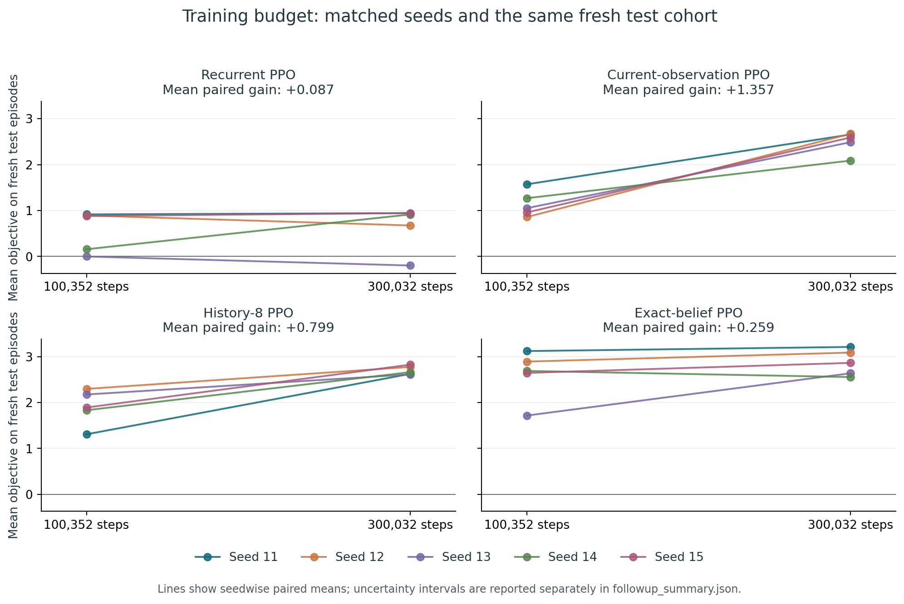
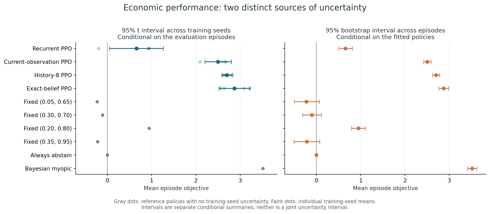

# Does the Agent Know When It's Being Picked Off?
## Fixed-budget follow-up — 27 September 2026

This memo records the budget extension. Its proposed GAE comparison has subsequently been completed in the separate [GAE experiment memo](gae_memo.md); the results and recommendations below describe the budget stage.

**The larger budget did not rescue recurrent PPO.** At 300,032 transitions, its mean objective was **0.657**, versus **2.500** for current-observation PPO, **2.700** for history-8 PPO, **2.871** for belief-input PPO, and **0.946** for fixed wide quotes. Every recurrent seed's point estimate remained below the fixed-wide reference. Keep the project at the training-diagnosis stage; substantive representation probes and causal interventions remain deferred.

This memo supplements the [initial 100,352-step pilot](research_memo.md). Its historical results are preserved. The research question remains whether a recurrent dealer distinguishes informed flow from ordinary directional demand and uses that distinction in quoting.

### What ran and what stayed fixed

All four learned families ran for **300,032 transitions per seed**, using all five initialization seeds 11–15 and unchanged architectures, simulator, objective, gamma one, GAE lambda .95, entropy coefficient zero, learning rate, rollout size, batch size and epochs. All final checkpoints were included. No runs were extended or seeds discarded after inspecting returns. The [follow-up protocol](followup_protocol.md) records these choices and the behavior gate.

Each run restarted from the same initialization and environment streams as its shorter counterpart. This repeats the initial training prefix; it is a paired budget comparison, not an independent replication. Total training was **6,000,640 transitions**, of which **3,993,600** lie beyond the repeated prefixes. Three CPU workers took **1,897.8 seconds (31.6 minutes)** wall time; summed process training time was **5,342.4 seconds**. Evaluation, audits and reporting are additional.

Both budgets' 20 frozen checkpoints were evaluated stochastically on the **same 2,048 fresh episodes**, seeds 5,000,000–5,002,047. Customer tapes and categorical-action uniforms were paired while allowing different quotes to cause different executions. The shorter-budget numbers below are fresh reevaluations, not the original report's different test cohort.

### Budget effects and uncertainty

All returns are economic objective per episode in simulator cash units. The last column uses five **paired training-seed differences** and an approximate Student t4 interval.

| Policy | 100,352 steps | 300,032 steps | Paired gain | Gain: training-seed 95% CI |
|---|---:|---:|---:|---:|
| Recurrent PPO | 0.570 | 0.657 | +0.087 | [−0.405, 0.578] |
| Current-observation PPO | 1.143 | 2.500 | +1.357 | [0.854, 1.860] |
| History-8 PPO | 1.901 | 2.700 | +0.799 | [0.352, 1.247] |
| Belief-input PPO | 2.613 | 2.871 | +0.259 | [−0.233, 0.750] |

Every feedforward and history seed improved. The recurrent gains for seeds 11–15 were **+0.028, −0.217, −0.196, +0.758, +0.062**. Much of the average increase comes from seed 14 approaching fixed quoting. Belief-input PPO improved in four seeds but still has considerable uncertainty in its budget effect.

For the **fixed set of fitted policies**, whole-episode bootstrap intervals for the four budget gains are respectively **[0.046, 0.130]**, **[1.293, 1.419]**, **[0.767, 0.831]**, and **[0.235, 0.283]**. These narrower intervals answer a different question from the seed intervals. We average paired policy-seed differences within each episode before resampling; neither timesteps nor 5×2,048 outcomes are treated as independent. Neither interval combines both uncertainty sources. Five-seed t intervals are approximate, especially for a mixture of collapsed and varying policies. Crossing zero is uncertainty, not evidence of equivalence.

### Final policy comparisons

The full seed distribution at 300,032 steps is:

| Training seed | Recurrent | Current observation | History-8 | Belief input |
|---|---:|---:|---:|---:|
| 11 | 0.945 | 2.657 | 2.624 | 3.211 |
| 12 | 0.676 | 2.674 | 2.776 | 3.088 |
| 13 | −0.197 | 2.489 | 2.613 | 2.637 |
| 14 | 0.915 | 2.088 | 2.662 | 2.555 |
| 15 | 0.946 | 2.593 | 2.825 | 2.864 |

Training-seed SDs are **0.490, 0.241, 0.095, 0.282**, respectively; separate episode SEs of the fitted-family means are **0.080, 0.042, 0.042, 0.056**. The Bayesian myopic reference earns **3.513** (episode SE 0.055), fixed-wide earns **0.946** (SE 0.080), and abstention earns zero. Other predeclared fixed actions 2, 4 and 8 earn −0.227, −0.105 and −0.217. Myopic is a reference, not a proven finite-horizon optimum.

Recurrent minus history-8 is **−2.043**, with seed interval **[−2.611, −1.475]** and separate episode interval **[−2.157, −1.924]**. Recurrent minus feedforward is **−1.843**, with seed interval **[−2.534, −1.152]**. Recurrent minus fixed-wide is **−0.289**: its episode interval is **[−0.337, −0.241]**, while its seed interval **[−0.898, 0.320]** remains broad. No recurrent point estimate exceeds fixed-wide, although this is not a population-level proof of universal inferiority.

### Behavior and decision gates

Seeds 11, 14 and 15 submit the centered wide quote on **99.95%, 96.98% and 99.99%** of arrivals; it is their most probable action at every evaluated decision. Their across-episode action-probability variation at fixed time is negligible. Seed 13 uses the low-center wide quote `(0.05,0.65)` on **89.90%** of arrivals and abstains on **9.82%**; its variation is predominantly a time schedule. Seed 12 has input-dependent probabilities but earns only 0.676. Diversity in pooled action counts would conceal these failures.

The descriptive within-time probability-variance statistic for seeds 11–15 is **1.30e−10, 0.0401, 1.51e−5, 2.22e−8, 1.22e−11**. It excludes sampling noise and a purely time-dependent schedule; nonzero values can still reflect current observations or inventory, without older-history memory or adverse-selection inference.

Recurrent mean squared inventory is **75.49**, versus **40.20** for history-8 and **39.95** for myopic. Its descriptive pooled 5th-percentile objective is **−5.937**, versus **−0.536** for history-8. Mean profit per informed execution is **−0.203** versus **−0.110** for history-8. Diagnostic trader labels are never policy inputs.

- **Gate 1 — continue:** the original supported-history construction still shows decision relevance of earlier quote evidence; prevalence under learned policies remains unmeasured.
- **Gate 2 — revise:** the recurrent family has not demonstrated economically useful adaptive behavior beyond the predeclared fixed anchor.
- **Gate 3 — revise:** every recurrent seed trails both matched-budget public-observation comparators. Recurrence adds no demonstrated benefit in this setup and budget.
- **Gate 4 — defer:** no substantive probes or causal interventions ran. The reserved analysis cohort beginning at 6,000,000 remains unused; smoke probes remain implementation checks only.

Architectures differ in capacity. Even current-observation PPO has historical information through inventory and the previous action; history-8 inputs can inherit older information through those channels. These comparisons do not isolate a universal causal effect of memory architecture.

### Verification and next experiment

**111 tests pass**, with 14 upstream Matplotlib/Pyparsing deprecation warnings. The completed audit verifies all 20 budgets, matching initializations, disjoint training/evaluation streams, unchanged core training sources, finite logged metrics, and exact equality of the matched rollout and optimizer prefix logs. These are logged-prefix checks, not a claim that every original observation was archived. The [manifest](../published-results/followup_manifest.json) binds both budgets' artifacts and rejects incomplete or mismatched evidence.

A seed-13 diagnostic resolved an apparent training/evaluation discrepancy: +1.937 was a **16-episode rollout mean**, while the concurrent rolling 100-episode mean was −0.172. Across 256 checked decisions, the evaluation adapter matched upstream SB3 probabilities, hidden/cell states and resets exactly, including the stock recurrent sequence path. Four recorded objectives replayed within 1.8e−15. This check found no adapter explanation for the failure; it does not prove all implementations bug-free. [Diagnostic evidence](../published-results/followup_diagnostics/seed13_audit.json), [learning curves](followup_figures/learning_curves.png).

The next proposed experiment is **GAE lambda .95 versus 1.0**, holding gamma one, entropy zero, the architecture, objective and 300,032-step budget fixed across five paired recurrent seeds. Complete-episode lambda-one advantages reduce reliance on intermediate critic estimates for terminal settlement, but can increase variance. Low entropy and terminal credit assignment remain hypotheses, not diagnosed causes. Reevaluating both arms and the fixed/history references on newly reserved episodes is essential: this recommendation is development informed by the present test failure. Do not change entropy simultaneously or select favorable checkpoints. A positive result would establish sensitivity to the advantage estimator, not prove the mechanism. This ablation has **not** run. [Prioritized next experiments](next_experiments.md).

Machine-readable tables, all seed outcomes and regime diagnostics: [summary JSON](../published-results/followup_summary.json), [summary CSV](../published-results/followup_summary.csv), [gate decisions](../published-results/followup_decision_gates.json). The initial shift experiment remains in the original memo; this follow-up makes no new representation, causal-use or distribution-shift claim.
