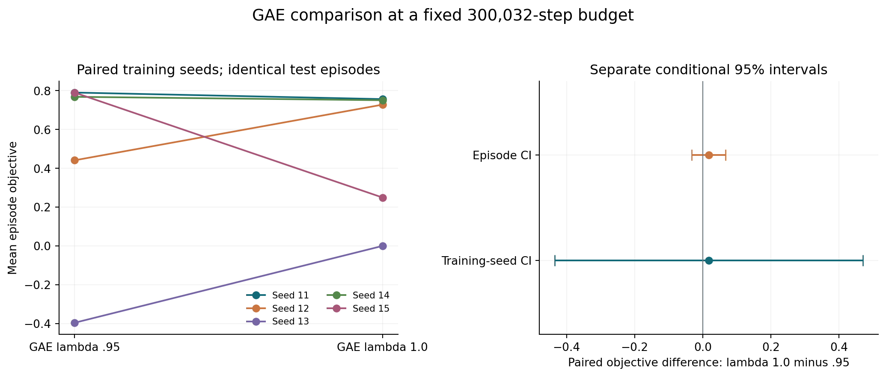
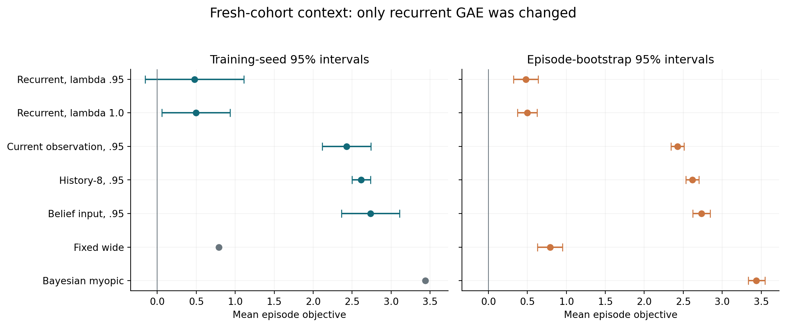

# Does the Agent Know When It's Being Picked Off?
## Single-factor GAE experiment — 27 September 2026

Historical report: the proposed entropy follow-up has since completed. See the [entropy memo](entropy_memo.md) for that separate experiment; the GAE results below remain unchanged.

**Changing recurrent GAE lambda from .95 to 1.0 did not establish useful adaptive behavior.** The mean economic objective moved from **0.479 to 0.497**, a paired difference of **+0.018** with a training-seed 95% interval of **[−0.434, 0.470]**. None of the five new policies beat fixed wide quoting in its point estimate. Keep representation probes and causal interventions deferred.

This is a completed diagnostic experiment following the [budget comparison](followup_memo.md). It tests sensitivity to the advantage estimator, not whether terminal credit assignment is the cause of earlier failures. The [protocol](gae_protocol.md) was recorded before training.

### Controlled comparison

Five new recurrent policies used GAE lambda one at **300,032 transitions** each, with paired initialization seeds 11–15. Gamma remained one, entropy coefficient zero, learning rate .0003, eight environments, 128-step rollouts, batch64 and ten PPO epochs. The simulator, observations, objective and separate actor/critic LSTM architectures were unchanged. All final checkpoints were retained, without extending budgets or selecting successful seeds.

The existing lambda-.95 recurrent checkpoints were the control. Initial weights and simulator streams matched within each seed; the first rollout's economic logs matched exactly before any optimizer update. Later trajectories can diverge because the estimator changes learning. There are five paired seed comparisons, not ten independent repetitions.

New training totaled **1,500,160 transitions**, taking **907.3 seconds (15.1 minutes)** with three CPU workers. Summed process training time was **2,251.7 seconds**. Evaluation and audits also ran concurrently on the CPU; their stages are additional.

Both arms and existing feedforward, history-8 and belief-input policies were evaluated on the **same 2,048 new episodes**, seeds 8,000,000–8,002,047. Customer tapes and separate action-sampling uniforms were paired; quotes still generated different executions. These are fresh reevaluations, so the control means differ from those in earlier reports. The development cohort at 7,000,000 and conditional probe cohort at 9,000,000 remain unused.

### Primary result

| Training seed | GAE .95 | GAE 1.0 | Paired difference |
|---|---:|---:|---:|
| 11 | 0.790 | 0.756 | −0.034 |
| 12 | 0.441 | 0.728 | +0.287 |
| 13 | −0.396 | −0.00022 | +0.396 |
| 14 | 0.768 | 0.750 | −0.018 |
| 15 | 0.790 | 0.249 | −0.540 |
| Mean | **0.479** | **0.497** | **+0.018** |

Only two seeds improved. Seed 13's improvement mainly replaces a losing directional policy with near-total abstention; this is not evidence of learning to distinguish informed flow.

The approximate Student t4 interval across **five paired seed differences** is **[−0.434, 0.470]**. The separate whole-episode bootstrap interval is **[−0.032, 0.068]**, conditional on these fitted policies. For the latter, paired differences are averaged across seeds within each episode before resampling. Neither timesteps nor all seed-by-episode observations are independent replicates. Neither interval combines both uncertainty sources, and five heterogeneous seeds make the t interval approximate. This result does not demonstrate equivalence or rule out every economically relevant effect.

### Behavior and economic context

| Policy on the fresh cohort | Mean objective | Training-seed SD | Episode SE |
|---|---:|---:|---:|
| Recurrent, GAE .95 | 0.479 | 0.511 | 0.081 |
| Recurrent, GAE 1.0 | 0.497 | 0.351 | 0.063 |
| Current observation, GAE .95 | 2.428 | 0.252 | 0.043 |
| History-8, GAE .95 | 2.617 | 0.095 | 0.042 |
| Belief input, GAE .95 | 2.734 | 0.300 | 0.058 |
| Fixed wide `(0.20,0.80)` | 0.790 | — | 0.081 |
| Bayesian myopic | 3.438 | — | 0.057 |
| Abstention | 0.000 | — | 0.000 |

The other predeclared fixed actions 2, 4 and 8 earned −0.453, −0.370 and −0.382. Myopic is a reference, not a proven finite-horizon optimum. The nonrecurrent policies kept their original GAE setting; their comparisons provide economic context rather than isolating an architectural causal effect.

Lambda-one recurrent policies trail history-8 by **−2.120**, with seed interval **[−2.585, −1.655]**, and fixed-wide by **−0.294**, with seed interval **[−0.730, 0.142]** and separate episode interval **[−0.332, −0.255]**. The fixed-reference seed interval is broad despite all five observed point estimates being lower.

Seeds 11, 12 and 14 used fixed wide quotes on **95.54%, 95.75% and 97.86%** of decisions. Seed 13 abstained on **99.998%**. Seed 15 was more variable but earned only 0.249; it used wide quotes 64.92% of the time and abstained 9.61%. Input-dependent action-probability variation at fixed time was negligible for seeds 11, 13 and 14, and **0.00311** and **0.01569** for seeds 12 and 15. Nonzero variation can reflect current observations or inventory; it does not identify older-history memory or adverse-selection inference.

Aggregate abstention increased from **2.61% to 22.78%**, while mean squared inventory fell from **78.72 to 59.18**. Mean profit before the inventory penalty changed from **0.5573 to 0.5559**, while the penalty fell from **0.07872 to 0.05918**. Thus the small objective increase is accounted for by the reduced penalty, not increased pre-penalty profit. The descriptive pooled 5th-percentile objective improved from −6.157 to −4.477, partly alongside lower participation. Mean profit per informed execution did not improve: −0.2037 versus −0.2059. These are diagnostic descriptions, not an isolated causal decomposition of policy behavior.

### Tests, audit and gate decisions

**126 tests pass**, with 14 upstream Matplotlib/Pyparsing deprecation warnings. The new tests verify that lambda-one returns match whole-episode reward sums with arbitrary critic values and no cross-episode leakage. Actual rollout logs confirm 16 completed 64-arrival episodes per rollout. The audit checks all 25 learned-checkpoint evaluations, their configurations and paired episodes, serialized recurrent GAE/gamma/entropy settings, finite recurrent parameters, and unchanged core training sources. Existing control checkpoint hashes match the earlier archive.

One audit assumption needed refinement: **171 rows** of seed 13's `train/explained_variance` are NaN. SB3 explicitly defines that diagnostic as NaN for zero target variance, which is consistent with near-total abstention and lambda-one returns. Other logged optimization/economic metrics and serialized parameters were finite. Historical target variances were not archived, so the logs do not prove the cause of every undefined row. The audit now records this one diagnostic exception explicitly; it still rejects nonfinite losses, economic metrics or infinite diagnostics. No training settings or records were changed to handle it.

- **Gate 1 — continue:** the original supported-history construction remains valid; prevalence under learned policies is still unmeasured.
- **Gate 2 — revise:** the lambda-one family did not demonstrate useful adaptive behavior beyond fixed wide quoting.
- **Gate 3 — no recurrence benefit demonstrated:** all five new recurrent policies trail both public-observation comparators at this budget. Their memory channels and capacities differ, so this is not a universal architectural conclusion.
- **Gate 4 — defer:** no substantive probes or causal interventions ran. Decodability and causal use remain unestablished.

### Next experiment

The next bounded diagnostic I recommend is **entropy coefficient 0 versus 0.01**, retaining **GAE .95**, gamma one and the 300,032-step budget across five paired recurrent seeds. Reuse the zero-entropy control and change only this coefficient. The present experiment gives no convincing reason to adopt lambda one as the new default. Early concentration on simple policies motivates the entropy test, but is not proof that insufficient exploration caused failure; seed 15 shows that action diversity alone is insufficient.

Predeclare fresh development and final-test cohorts and keep the same economic objective for evaluation. Entropy regularization changes the training loss, so report it explicitly. Keep all seed outcomes and require useful input-dependent decisions, not merely higher entropy or more trading. Do not combine it with another GAE change, extend budgets until success, or claim confirmation from the now-consumed 8,000,000 cohort. A later positive result needs fresh training-seed replication. **This proposed entropy experiment has not run.**

[Reproduction commands](../README.md#controlled-gae-comparison), [full summary](../published-results/gae_summary.json), [CSV](../published-results/gae_summary.csv), [audit manifest](../published-results/gae_manifest.json), [gate decisions](../published-results/gae_decision_gates.json). Prior pilot and budget reports remain intact.
