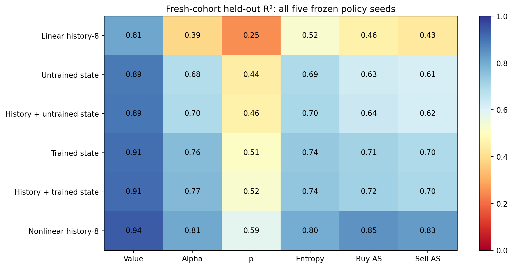

# Nonlinear recent-history control — 27 September 2026

**A nonlinear decoder of the last eight observations outperforms the linear trained-state decoder on all six targets on average.** The earlier advantage over a linear history baseline is therefore insufficient evidence that older recurrent memory is necessary for decoding these posterior quantities. This is a stronger control on the original policies, separate from the new training-seed replication.

## Fixed comparison

The [protocol](nonlinear_protocol.md) was written before collecting 1,024 fresh episodes beginning at 14,000,000. All five frozen entropy-.01 policy checkpoints, seeds 11–15, were included, including the two weak economic policies. Checkpoint hashes match the archived experiment. No policy was retrained for this comparison.

Each panel contains 65,536 collected decisions, of which arrivals 8–63 give 57,344 probe rows. The unchanged whole-episode split uses 614 training, 205 validation and 205 held-out test episodes. Targets are the same observation-supported posterior quantities, including buy/sell adverse information at the fixed `(0.20,0.80)` quote. Every held-out target has positive variance in every seed.

All seven original ridge panels were refitted on this cohort. The new comparator is a 72→64→64→6 tanh network with 9,222 parameters. It consumes exactly the same flattened history-8 features, with train-only input and target scaling. Two weight-decay candidates each train for 40 epochs; selection uses validation standardized MSE at eight fixed checkpoints per candidate. The test set never selects a setting or checkpoint. All five selected weight decay .0001; selected epochs were 40,30,40,30,30. Summed panel runtime was 142.9 seconds on the shared CPU, excluding separate analysis/reporting.

The neural and ridge models have different capacities and tuning budgets. This is a test of whether a stronger recent-history control explains the linear-probe finding, not a capacity-matched comparison or an exhaustive conditional-independence test.

## Held-out prediction

Mean R² across all five policy seeds:

| Features and decoder | Value | Alpha | p | Entropy | Buy AS | Sell AS |
|---|---:|---:|---:|---:|---:|---:|
| Basic, ridge | .794 | .326 | .248 | .503 | .436 | .419 |
| History-8, ridge | .812 | .385 | .252 | .524 | .458 | .433 |
| Trained state, ridge | .909 | .762 | .510 | .737 | .712 | .695 |
| Basic + trained state, ridge | .910 | .765 | .514 | .738 | .714 | .697 |
| History + trained state, ridge | .911 | .771 | .524 | .742 | .717 | .699 |
| Untrained state, ridge | .889 | .683 | .445 | .694 | .628 | .614 |
| History + untrained state, ridge | .892 | .695 | .456 | .700 | .637 | .620 |
| **History-8, nonlinear** | **.940** | **.805** | **.585** | **.799** | **.847** | **.830** |

Nonlinear history improves on linear history for all targets. Compared with history-plus-trained-state ridge, nonlinear history reduces buy-AS MSE by **0.000343**, with approximate training-seed interval **[0.000096, 0.000591]**, and sell-AS MSE by **0.000363**, interval **[0.000096, 0.000631]**. All five seed-level adverse-selection differences favor nonlinear history. The separate conditional episode intervals are **[0.000303, 0.000386]** and **[0.000320, 0.000410]**. These are raw squared-target units, not economic profit.

The complete [machine-readable analysis](../published-results/iteration-v1/analysis/nonlinear_summary.json) retains all targets, all seed outcomes, relative and absolute MSE contrasts, fit choices and target variances. Seed intervals and whole-episode intervals are separate conditional summaries; neither integrates both sources or probe-fitting uncertainty. Comparisons remain exploratory and unadjusted for multiple targets.

Trained state still improves on the untrained-state ridge control for several targets on this cohort. That finding does not override the stronger nonlinear-history result. Current inventory and previous policy actions already carry history, so even the history-only network is not restricted to eight arrivals' raw evidence in an information-theoretic sense.

## Revised claim boundary

Posterior quantities are linearly accessible from trained recurrent state, but the available evidence does not establish information uniquely supplied by older recurrent memory. A recent-history nonlinear decoder does at least as well in the aggregate comparison and substantially better for the adverse-selection targets. This does not prove the recurrent state contains no older information, nor that a nonlinear state decoder could not improve further. Neither decoder comparison tests causal policy use.

Keep causal interventions deferred. The next research decision should follow the independent-seed economic replication, not an attempt to obtain a positive memory claim by selecting a decoder or seed. The original results remain intact in the first published snapshot; this fresh-cohort study refines their interpretation.

Reproduce collection/fitting with `python -m scripts.run_nonlinear_control` after the original entropy checkpoints exist, then `python -m scripts.analyze_iteration nonlinear`. Managed manifests verify complete artifacts and checkpoint identity; arrays and decoder weights remain local while text evidence is published.
