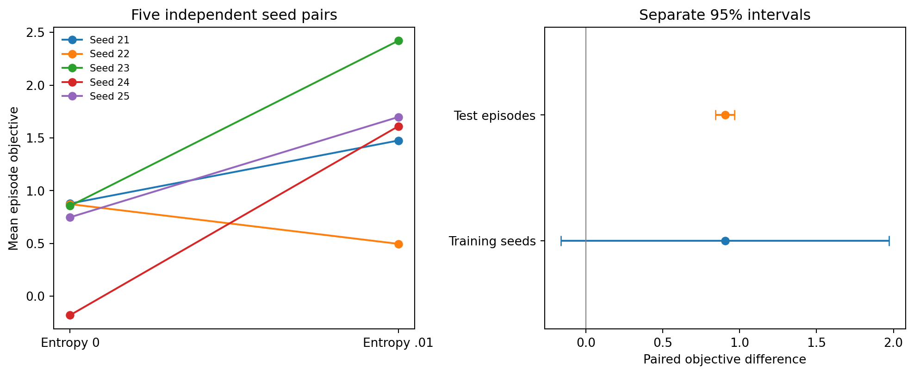

# Independent-seed entropy replication — 27 September 2026

**The positive mean effect recurred, but the predeclared replication criterion was not met.** With five fresh seed pairs, entropy .01 increased mean objective from **0.635 to 1.540**, paired gain **+0.905**. Four pairs improved. The approximate training-seed 95% interval remains **[−0.162, 1.972]**, including zero. This is additional directional evidence with unresolved initialization variability, not confirmation of reliable learning.

## Fixed design and execution

The [protocol](replication_protocol.md) fixed seeds 21–25, both entropy arms, the 300,032-step budget, GAE .95 and unchanged scientific implementations before training. All ten models completed: **3,000,320 new transitions**, **1,527.9 seconds (25.5 minutes)** of training-stage wall time with three workers, and **3,900.9 seconds** summed process training time. No seed was replaced and no budget was extended. The managed wrapper passed an exact parameter-digest equivalence check against the underlying trainer on a short matched run.

Initial weights and simulator streams matched within each pair; streams were disjoint across training seeds. First pre-update rollout economics matched exactly. Both arms and references used **2,048 fresh episodes beginning at 15,000,000**, with common customer tapes and separate common action uniforms. Quotes still generated different executions. Development at 13,000,000 and potential replication probes at 16,000,000 remain unused.

## All outcomes

| Seed | Entropy 0 | Entropy .01 | Paired gain |
|---|---:|---:|---:|
| 21 | .878 | 1.475 | +.597 |
| 22 | .873 | .496 | −.376 |
| 23 | .856 | 2.420 | +1.564 |
| 24 | −.179 | 1.610 | +1.789 |
| 25 | .748 | 1.698 | +.950 |
| Mean | **.635** | **1.540** | **+.905** |

Fixed wide quoting earned **.880** and Bayesian myopic **3.480** on this cohort. The treatment-minus-fixed-wide mean was **+.660**, seed interval **[−.195, 1.516]**. Seeds 21,23,24,25 exceeded fixed wide and met the predeclared within-time action-probability variation threshold .01. Seed 22 varied its actions but performed poorly, again showing that action diversity is insufficient.



The paired-effect episode-bootstrap interval is **[.842, .965]**. It averages paired differences over the fixed five policy pairs before resampling whole episodes, and is conditional on those fitted models. The seed interval is conditional on this episode cohort. Neither interval is joint; timesteps and seed-by-episode rows are not independent replicates. Five heterogeneous seed pairs make the t4 approximation limited.

| Predeclared condition | Observed result | Met? |
|---|---|---|
| Mean paired gain at least .25 | .905 | Yes |
| Paired gain's seed interval entirely above zero | [−.162, 1.972] | No |
| Treatment-minus-fixed seed interval entirely above zero | [−.195, 1.516] | No |
| At least three useful, input-dependent treatment seeds | Four | Yes |

Both failed interval conditions remain failures even though the episode intervals are positive. The decision rule was not relaxed after seeing the results. Failure of the criterion does not prove zero effect or equivalence of the algorithms. The original five-seed development contrast was +.715 with seed interval [−.638, 2.069]; it is kept separate rather than pooled into a confirmatory result after informing the chosen experiment.

Mean pre-penalty profit increased from **.718 to 1.600**, while mean inventory penalty fell from **.0825 to .0598**. Mean squared inventory fell from **82.54 to 59.77**, and abstention increased from **.074% to 2.271%**. These are descriptions of the policies and their selected executions, not evidence that informed customer type was causally inferred.

## Audit and claim boundary

All ten completed training directories and twelve evaluation directories pass their artifact checks. Evaluation records checkpoint hashes at collection time and links the originating managed run ID. The audit checks frozen configuration/code/dependencies, serialized gamma/GAE/entropy settings and budgets, finite model parameters and optimization diagnostics, paired regimes, complete episodes and reward accounting. There were no undefined explained-variance rows in these new runs. The local suite has **157 passing tests**, including interruption, cache corruption, process locking, portability and decoder-selection guards.

This replication tests the entropy coefficient, not a recurrence advantage: no new architecture comparison was trained. The separate [nonlinear history control](nonlinear_memo.md) also weakens the interpretation of the original representation result. Together, the studies support useful adaptive behavior in several seeds and accessible posterior information, while reliable training, uniquely older-memory information and causal use remain unestablished.

Before spending more compute, define the desired precision and replication budget, and measure how frequently earlier evidence is decision-relevant on actual trajectories. Do not proceed directly to causal state patches or another uncontrolled sweep. No additional training or causal interventions ran in this iteration.

## Reproduce

```powershell
python -m scripts.run_replication preflight
python -m scripts.run_replication train --workers 3
python -m scripts.run_replication evaluate --workers 3
python -m scripts.analyze_iteration replication
```

Completed jobs are verified and reused; interrupted jobs restart from their declared seeds in a new attempt. The [public analysis](../published-results/iteration-v1/analysis/replication_summary.json) includes all seed outcomes, behavior, accounting metrics and provenance. Original local records and earlier public snapshots remain intact.
