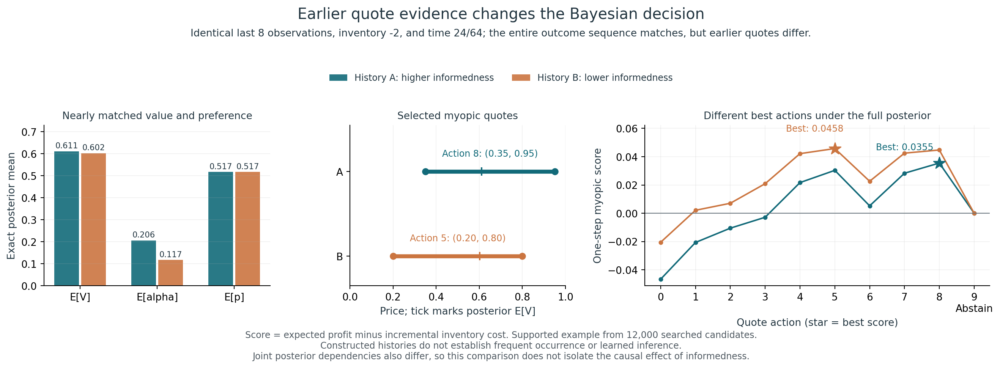
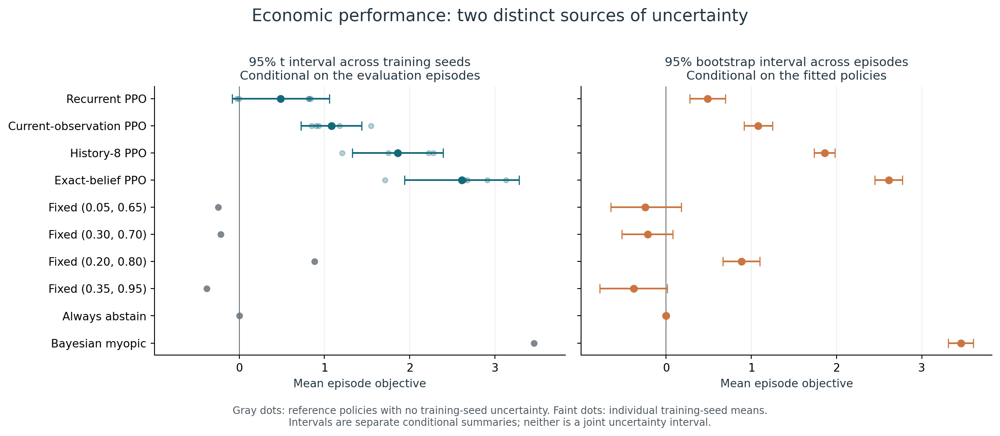

# Does the Agent Know When It's Being Picked Off?
## Initial research pilot — 27 September 2026

This memo records the original 100,352-step experiment. The subsequent completed 300,032-step comparison is documented separately in the [follow-up memo](followup_memo.md); the results and recommendations below describe the initial stage.

**Result: the environment supports the intended inference problem, but recurrent PPO did not learn a useful advantage at the 100,352-step budget.** It averaged **0.486** economic objective per episode, versus **0.884** for fixed wide quotes, **1.860** for history-8 PPO, and **3.460** for the Bayesian myopic reference. Continue the project at the training-diagnosis stage. Do not proceed to causal interventions or interpret decodability as learned economic understanding.

### Question and implementation

Can a recurrent dealer distinguish informed customer flow from ordinary directional demand using the prices customers accepted or declined? Three claims must remain distinct: retained historical evidence, decodable adverse-selection information, and causal use in quoting.

The implemented 64-arrival market has the requested 12 fixed hidden regimes, nine interior quotes and abstention, customer-level simulation, exact joint Bayesian inference, public 9-feature observations, and the specified undiscounted settlement objective. All directions describe the customer. Rewards and diagnostic labels never enter policy features. The Bayesian myopic reference conditions on actual quotes and includes no-trade evidence; it is not the finite-horizon optimum.

**82 tests pass**, including Monte Carlo likelihood validation, independent history enumeration, accounting/fees/settlement telescoping, symmetry, abstention, Gymnasium boundaries, reproducibility, leakage, whole-episode splits, recurrent resets, and adapter equivalence. Dependency validation passes. Fourteen warnings are upstream Matplotlib/Pyparsing deprecations.

### Gate 1: meaningful inference — continue

A constructive search found two positive-probability 24-arrival histories with identical customer outcomes, inventory −2, time, and the entire most recent `8×9` observation window. Earlier quote prices differ. Their posterior means are:

| Quantity | History A | History B |
|---|---:|---:|
| Expected value | 0.6110 | 0.6023 |
| Expected uninformed buy preference | 0.51655 | 0.51651 |
| Expected informed fraction | 0.2058 | 0.1172 |
| Myopic bid/ask | (0.35, 0.95) | (0.20, 0.80) |

Earlier quote evidence can therefore change the reference decision despite identical recent inputs. These are constructed histories, not evidence of prevalence under learned policies. Joint dependencies also change, so this does not isolate an alpha-only causal effect. Both chosen quotes have the same spread: higher estimated informedness does not universally imply widening. [Full derivation and support checks](model_design.md).

### What ran

Twenty training runs, with five independent training seeds per family: recurrent, current-observation, history-8, and belief-input PPO, each with **100,352 transitions**—**2,007,040 main training transitions** in total. Seeds are paired across families. All use gamma 1, learning rate .0003, batch64, ten epochs, eight environments and 128 steps per rollout. Actor and critic LSTMs are separate, one-layer, 64-unit networks. Capacity differs across families and is documented in the README.

Each final checkpoint was evaluated stochastically on the same 1,024 fresh episodes. Customer tapes are paired; policy-dependent executions differ. Final checkpoints, rather than favorable intermediate checkpoints, were used. No setting was tuned on these test returns. Main training took 569.9 seconds wall time with three CPU workers; summed process training time was 1,570.9 seconds. Setup, tests, benchmarks and analysis are additional.

A further 1,024 paired episodes per policy evaluated `alpha=.05,p=.90`, with a matched `alpha=.05,p=.75` control changing only p. Reference inventory-penalty sensitivity used lambda 0, .001 and .01. No 300,032-step or million-step training experiment ran.

### Economic results and Gates 2–3

All values below are in simulator cash units per episode. Training-seed SD and episode SE measure different uncertainty sources and are not combined.

| Policy | Mean objective | SD across 5 training seeds | Episode SE, averaging fitted seeds |
|---|---:|---:|---:|
| Recurrent PPO | 0.486 | 0.461 | 0.108 |
| Current-observation PPO | 1.081 | 0.288 | 0.085 |
| History-8 PPO | 1.860 | 0.431 | 0.064 |
| Belief-input PPO | 2.612 | 0.542 | 0.083 |
| Fixed (0.20, 0.80) | 0.884 | — | 0.113 |
| Always abstain | 0.000 | — | 0.000 |
| Bayesian myopic | 3.460 | — | 0.076 |

Recurrent seed means were **0.839, 0.817, −0.030, −0.006, 0.812**. Three seeds submitted the centered wide quote on at least 94.9% of arrivals. The other two favored opposite off-center quotes on 71.7% and 63.9% of arrivals. Averaging their action distributions would hide these seed-specific directional failures. None of the five point estimates beats the fixed-wide benchmark on the paired test cohort.

The recurrent-minus-history objective gap is **−1.373**. Its 95% interval across training-seed differences is **[−2.262, −0.484]**; the separate episode-bootstrap interval conditional on these fitted policies is **[−1.493, −1.249]**. Recurrent-minus-current-observation is −0.594, but its training-seed interval **[−1.233, 0.045]** crosses zero. Five seeds support only limited population-level precision.

Recurrent mean squared inventory is **79.55**, versus **44.54** for history-8 and **39.71** for myopic. Its descriptive 5th-percentile objective is **−6.716**, versus **−1.650** for history-8. Average loss per informed execution is **−0.202** for recurrent and **−0.087** for myopic. These reinforce the economic failure beyond the mean reward alone; diagnostic trader labels are not policy inputs.

**Gate 2: revise recurrent training.** It learned participation and a preference for wide quotes, but not a credible adaptive improvement over fixed quoting. Other policy families demonstrate that useful behavior is attainable in this environment. **Gate 3: no recurrence benefit at this budget; revise before pursuing that claim.** This does not establish that recurrence is intrinsically unhelpful or that any policy converged.

### Gate 4: stop interpretation for this pilot

Activation collection, held-out ridge probes, same-history untrained-network controls, and explicit hidden/cell intervention timing are implemented and smoke-tested. **Substantive probes on the main recurrent policies were deliberately not run**, because the behavior gate failed. Smoke probe files validate the pipeline only and are excluded from the research summary. There is no empirical claim here that the trained state preserves economically relevant beliefs or uses them causally.

Even successful future linear probes would not establish causal use or information beyond a nonlinear function of recent history. Include the untrained control, stronger recent-history predictors, multiple policy seeds, and matched-history diagnostics before interpreting a representation.

### Focused shift and penalty checks

On paired low-alpha episodes, increasing p from .75 to .90 lowers training-model myopic objective from **3.529 to 3.102**, while the correctly specified myopic reference rises from **4.139 to 4.424**. The reference gap increases by **0.712**, with episode-bootstrap 95% interval **[0.579, 0.851]**. Correct filters know each cohort's alpha/p support but still infer V; the retaining filter keeps the original prior and support.

Under fixed wide quotes and true V=0, mean final inferred value from the training filter rises from **0.561 to 0.694** across the same p change. The correctly specified shifted filter gives **0.166**. Ordinary buying can therefore resemble positive value information under the retained model. This is a filter diagnostic; the recurrent policies' failed in-distribution gate prevents a claim about learned confusion or robust generalization. [Full paired shift data](../published-results/shift_diagnostics.json).

The fixed-wide exact expected objective is .84748 at lambda .001, versus profit .928 before penalty. For the adaptive myopic reference, raising lambda from .001 to .01 barely changes mean squared inventory (**39.7095 to 39.6876**); its objective falls mostly through the direct charge. The default has not been established as behaviorally well calibrated.

### Failures, limitations, and next decision

The first partial training batch was discarded after detecting overlapping vector-environment random streams across adjacent model seeds. Corrected runs use disjoint simulator streams. Stock recurrent CPU training was slow; a narrowly scoped, tested-equivalent fused reset path improved smoke throughput from 95.7 to 722 transitions/second without changing PPO updates. Float32 probe fitting produced conditioning warnings in the smoke pipeline; float64 fitting resolved them. [Protocol and deviations](experiment_protocol.md), [compute evidence](compute_benchmark.md).

All nonempty logged training diagnostics are finite. Maximum logged approximate KL across runs was .0212. Low recurrent entropy is consistent with early commitment to simple quotes. Limited training time, credit assignment, critic error, and zero entropy regularization are **hypotheses**, not diagnosed causes. Gamma one preserves reward accounting; GAE lambda .95 does not make the telescoping objective wrong.

**Recommended next experiment:** run the unchanged architecture and PPO settings to a predeclared **300,032-step** budget for all five seeds and matched learned baselines, with a fresh test cohort. This separates insufficient optimization time from a need to revise the learning setup. If recurrent collapse persists, test one controlled credit-assignment or exploration change at a time. Keep the original negative pilot intact. **Do not proceed to causal interventions yet.** [Prioritized experiments and commands](next_experiments.md).

The artifacts establish a working research platform and a defensible negative initial result. They do not establish convergence, optimality, real-market profitability, novelty, learned adverse-selection representations, or causal use of such representations.
