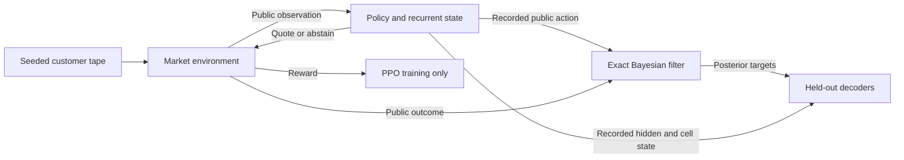

# Information flow and statistical estimands

## Observation and inference

An episode has 64 arrivals and a fixed latent state `s = (V, alpha, p)` drawn from 12 regimes. The dealer selects one of nine quotes or abstains. Ordinary learned policies receive previous quote/outcome, inventory and time; the belief-input baseline additionally receives the posterior.



For an active quote `a_t` and observed outcome `o_t`, the filter updates `w_(t+1)(s) ∝ w_t(s) P(o_t | s, a_t)`. Abstention leaves the posterior unchanged. An active no-trade outcome is informative because rejection probabilities depend on the quote and latent regime. See the [likelihood derivation](model_design.md).

## Accounting and adverse-selection targets

The undiscounted reward sum equals `cash_T + q_T V − (lambda/T) Σ q_t²`, using post-arrival inventory. A customer buy decreases dealer inventory. Fees enter cash on each execution; abstention still incurs inventory cost.

Let `v = E[V | H_t]`. At the fixed reference quote `(bid, ask) = (.2, .8)`, buy-side adverse information is `E[V | H_t, customer buy] − v`; sell-side adverse information is `v − E[V | H_t, customer sell]`. These are posterior value revisions, not realized profit or customer-type labels. The remaining probe targets are posterior means of `V`, `alpha`, `p`, and joint entropy.

Inventory aggregates earlier executions, and previous policy actions may depend on older observations. A history-8 decoder therefore receives historical information through channels other than its explicit window.

## Paired economic comparison

Policies use common latent regimes, customer tapes and separate common action uniforms. Their quotes still produce different executions. Training arms share initialization and environment streams within each seed pair; different seeds use disjoint streams.

For seed `i` and episode `e`, let `d_ie = J_treatment,ie − J_control,ie`. The effect estimate is the average of all `d_ie`. The seed interval applies a Student t interval to the five episode-averaged seed differences. The episode bootstrap first averages differences across the fixed fitted policies, then resamples whole episodes. These are separate conditional uncertainty summaries. The replication's seed interval [−.162, 1.972] includes zero despite its positive mean gain.

## Decoder comparison

Train, validation and test sets contain disjoint whole episodes. Scaling is fitted on training data; decoder settings are selected on validation data. All policy seeds and all predeclared controls are retained. The audit checks episode membership, complete trajectories, paired prediction targets, per-episode losses and scores reconstructed from predictions.

Nonlinear history-8 decoding exceeded trained-state ridge decoding on all six targets on average. This comparison does not identify information unique to older recurrent state: model capacity and tuning budgets differ, and nonlinear state decoding was not tested. Predictive association also does not establish that the policy uses a decoded quantity to select its quote.

## Execution checks

```powershell
python -m pytest tests/test_iteration_analysis.py tests/test_managed_runs.py tests/test_run_store.py -q
```

Managed jobs publish a completed directory only after required artifacts and hashes are verified. Interrupted jobs restart from initialization. Tests reject modified checkpoints, changed configurations, incomplete trajectories and stale decoder metrics, and verify process-lock release after abrupt exit. Source hashes identify executed file contents; a Git revision alone does not establish a clean source snapshot.
