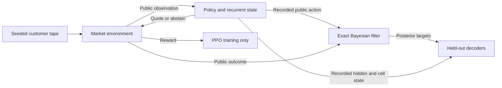

# A five-minute technical walkthrough

## 1. Define the inference problem

An episode has one of 12 fixed hidden regimes and 64 customer arrivals. The dealer chooses one of nine quotes or abstains. Its public inputs contain the previous quote/outcome, inventory and time. Value, informed fraction and ordinary directional demand are hidden. The exact filter maintains the joint posterior conditioned on the dealer's actual actions and resulting observations.



The filter and decoder targets are analysis instruments, not inputs to the ordinary learned policies. The belief-input baseline is an explicit exception. This boundary is more important than whether a neural network is recurrent.

## 2. Explain an invariant

Dense rewards must sum to terminal cash plus marked inventory minus carrying penalties. A customer buy decreases dealer inventory. No-trade evidence depends on the quoted prices; abstention produces no customer evidence. Tests enforce these distinctions rather than merely checking that the environment runs.

Inventory already summarizes older executions, and the previous policy action can encode history. Thus a current-observation or history-8 model is not necessarily history-free in an information-theoretic sense. A valid memory claim needs a stronger control than an architecture label.

## 3. Explain why the comparison is paired

Policies receive common customer tapes and separate common action-sampling uniforms. Their quotes still cause different executions. Within a training-seed pair, both entropy arms start with identical weights and environment streams. Different training seeds use disjoint streams.

Episode uncertainty asks about these fitted policies over customer realizations. Training-seed uncertainty asks about variability across fitted policies. Many test episodes cannot remove uncertainty caused by only five training initializations. The original entropy mean improved, but its seed interval included zero; the fresh replication tests that observation independently.

## 4. Show an engineering failure that is caught

```powershell
python -m pytest tests/test_managed_runs.py -q
python -m pytest tests/test_run_store.py -q
```

These tests use real short training runs to check checkpoint provenance, reuse, relocation and exact parameter equivalence with the underlying trainer. Fault tests reject changed checkpoints and configurations, preserve incomplete attempts, exclude a concurrent writer, and demonstrate that an abruptly exiting process does not leave a stale ownership lock.

Managed jobs write privately, verify outputs, then publish a complete directory. A restart reruns incomplete computation from the same seed; it does not pretend a partial PPO checkpoint contains every optimizer, environment and RNG state needed for exact continuation. Hashes protect against accidental stale/corrupt results, not an adversary rewriting the entire manifest.

## 5. Explain the result that changed the interpretation

Linear probes decoded posterior quantities from trained state, but random recurrent features also decoded well. A nonlinear recent-history control subsequently exceeded the linear trained-state decoder on all six targets on average, including substantially better buy/sell adverse-selection decoding. A weak economic policy also had high decoding scores.

The defensible conclusion is accessibility of posterior information, not evidence that older recurrent memory is necessary or causally used. This illustrates why a useful research result can narrow a claim rather than produce a positive headline.

The next discussion should focus on the replication's completed results and the precise unresolved question. Avoid equating a simulator objective with real-market profitability or proposing state patches before controlling their distribution and matching assumptions.
